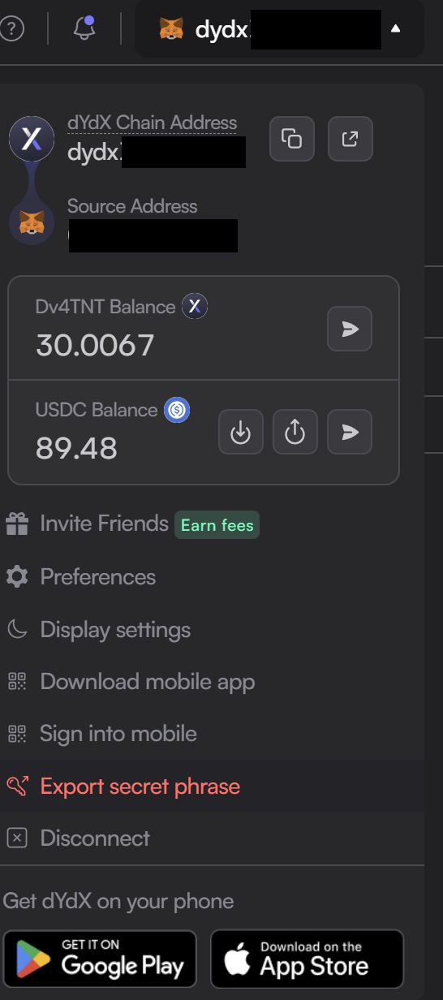

# Introduction
This is based on the "Build a Super Advanced Trading Bot on DYDX Hosted on AWS with Python: Advanced decentralized trading bot that runs on AWS and sends private messages to your Telegram account" course at Packt Publishing (https://www.packtpub.com/en-de/product/build-a-super-advanced-trading-bot-on-dydx-hosted-on-aws-with-python-9781835083857). In this version it's based on the V3 API of DYDX which was replaced by the V4 API. 

I figured out a bit late: An updated course for V4 APImight be available on udemy: https://www.udemy.com/course/dydx-pairs-trading-bot-build-in-python-running-in-the-cloud/?couponCode=24T7MT123024

Biggest modification was for the Keys because the authentication using "Stark Private Key" seems to be unavailable in the V4 API, so I had to find another way for authentication. Besides this, there seem to be some minor changed to the API. Below is an extra section describing how you can get your authentication information. The minor modifications are commented in the code.

# Authentication using DYDX Address / Mnemonic
I connected to DYDX using an Ethereum wallet (MetaMask). Description here is for the Sepolia-Testnet, but should work similar for the mainnet. It's important to understand that during connection, a separate "wallet" for DYDX is derived from your ethereum wallet. You might need to have some sepolia (testnet) eth to create the wallet which you can get from the seoplia faucet:
https://www.alchemy.com/faucets/ethereum-sepolia
You need a minimum balance of 0.001 ETH (real) on the Address you're using and you need an Alchemy account.

After opening the (testnet) exchange (dydx.exchange, Products-Testnet), on the top right corner you can connect your wallet. When your wallet is connected, you will see your DYDX-Address in the top right corner (starting with dydx). Clicking on the address opens a menu in which you can choose "Export secret phrase". This gives you the secret phrase (mnemonic) for your dydx-Address. Both the Address and the mnemonic are required to connect to DYDX for trading.

A word of caution: I stored my address/mnemonic in an insecure/unencrypted file here just for using the testnet during development. This is acceptable for experimenting and developing on an account holding only testnet ETH and no real value. I would would never recommend to store the mnemonic (private key) unencrypted for a "production" system where you have real value stored. Familiarize yourself with the concept of asymmetric encryption and the secure use and storage of the private key for Ethereum and extend the system accordingly before you start using real assets.

Here is an Example of the DYDX address (relevant part removed) and the menu item where you can get the secret phrase for the DYDX wallet.


# Setting up the python environment
On Windows I was using Anaconda. There, some packages (numpy, matplotlib, statsmodels) seem to be best installed using conda. The remaining packages (python-decouple, dydx-v4-client requests) can be installed using pip. Also, I would recommend creating a virtual environment:
```
conda create -n dydx python=3.12
conda activate dydx
conda install numpy matplotlib statsmodels
pip install python-decouple dydx-v4-client requests
```
